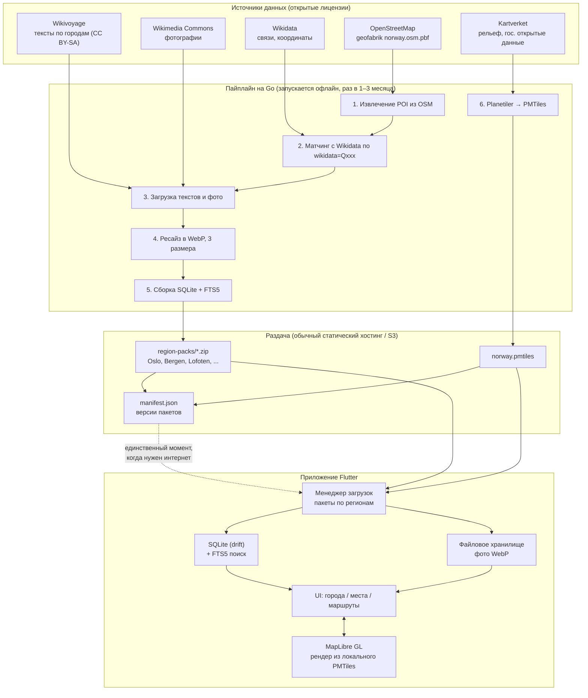

# Офлайн-гид по Норвегии (рабочее название: `nordguide`)

## 1. Идея в одном абзаце

Одно мобильное приложение (iOS + Android), которое полностью работает **без интернета**: карта всей Норвегии, все города и посёлки, достопримечательности с описаниями и фотографиями, готовые маршруты по городам, фильтры (фьорды, музеи, водопады, смотровые площадки, хайкинг). Всё содержимое скачивается один раз пакетами по регионам.

Пробел на рынке, который закрывается: сейчас пользователь вынужден совмещать Maps.me (карта без описаний) + Visit Norway (описания без офлайна) + UT.no (только тропы).

---

## 2. Выбор технологии

### 2.1 Сравнение вариантов

| Вариант | Язык | Офлайн-карты | Плюсы | Минусы |
|---|---|---|---|---|
| **Flutter** | Dart | MapLibre GL Native, `flutter_map`, поддержка MBTiles/PMTiles | Один код на обе платформы, лучший рендер карт среди кроссплатформы, зрелый SQLite-стек | Новый язык (но осваивается за 1–2 недели с бэкграундом PHP/Go) |
| React Native | TS/JS | `@maplibre/maplibre-react-native` | Знакомый JS-экосистеме стек, много библиотек | Офлайн-тайлы настраиваются заметно капризнее, производительность списков/карты хуже |
| Kotlin Multiplatform | Kotlin | MapLibre Android + нативно на iOS | Максимально нативно | UI пишется дважды, срок разработки ×1.7 |
| .NET MAUI | C# | слабая картографическая экосистема | — | Для карт практически не подходит |
| Нативно (Swift + Kotlin) | — | лучший результат | Максимальное качество | Двойная работа, для соло-разработчика нереально |

### 2.2 Рекомендация

**Flutter (Dart) + MapLibre GL + PMTiles + SQLite.**

Причины:
- MapLibre — это открытый форк Mapbox GL, векторные тайлы, полностью офлайн, без ключей и без оплаты за просмотры карты.
- PMTiles — один файл-архив тайлов, который просто лежит в файловой системе телефона. Не нужен ни сервер, ни tile-сервер, ни сложное управление кэшем.
- SQLite с расширением FTS5 даёт мгновенный полнотекстовый поиск по 100k+ объектов офлайн.
- Flutter отлично рендерит длинные списки и галереи изображений — это основной UI приложения.

### 2.3 Где пригодится ваш Go

Мобильное приложение — только «витрина». Вся тяжёлая работа — это **пайплайн подготовки данных**, и его логично писать на Go:

- парсинг OSM-выгрузки Норвегии (`.osm.pbf`) — библиотека `paulmach/osm`;
- обогащение данными Wikidata / Wikipedia / Wikivoyage;
- скачивание и ресайз фотографий с Wikimedia Commons;
- сборка итогового `content.sqlite` и региональных пакетов;
- запуск Planetiler для генерации `norway.pmtiles`.

То есть: **Go — генерация контента, Dart/Flutter — приложение.** PHP здесь не нужен вообще, кроме опционального админ-CMS на Laravel, если захотите редактировать описания вручную.

---

## 3. Архитектура



**Ключевой принцип:** интернет нужен ровно один раз — при скачивании регионального пакета. После этого приложение полностью автономно.

---

## 4. Модель данных (SQLite)

Тексты вынесены в отдельную таблицу переводов — см. §8. В основных таблицах остаётся только норвежское имя как канонический ключ.

```sql
CREATE TABLE regions (
    id           TEXT PRIMARY KEY,       -- 'vestland', 'nordland'
    name_no      TEXT NOT NULL,
    bbox         TEXT NOT NULL,          -- 'minLon,minLat,maxLon,maxLat'
    pack_size_mb INTEGER,
    pack_version INTEGER NOT NULL
);

CREATE TABLE cities (
    id           TEXT PRIMARY KEY,
    region_id    TEXT NOT NULL REFERENCES regions(id),
    name_no      TEXT NOT NULL,
    lat          REAL NOT NULL,
    lon          REAL NOT NULL,
    population   INTEGER,
    hero_photo   TEXT                    -- относительный путь к файлу
);

CREATE TABLE places (
    id           TEXT PRIMARY KEY,       -- 'osm:node/123456'
    city_id      TEXT REFERENCES cities(id),
    region_id    TEXT NOT NULL REFERENCES regions(id),
    category     TEXT NOT NULL,          -- fjord|museum|waterfall|viewpoint|church|hike|beach|glacier
    name_no      TEXT NOT NULL,
    lat          REAL NOT NULL,
    lon          REAL NOT NULL,
    opening_hours TEXT,
    website      TEXT,
    wikidata_id  TEXT,
    entrance_fee TEXT,
    season       TEXT,                   -- 'jun-sep' для горных дорог
    difficulty   TEXT,                   -- для троп
    duration_min INTEGER,
    importance   INTEGER DEFAULT 0       -- 0..100, для сортировки и офлайн-приоритета
);

CREATE TABLE photos (
    id           INTEGER PRIMARY KEY,
    place_id     TEXT REFERENCES places(id),
    city_id      TEXT REFERENCES cities(id),
    path_thumb   TEXT NOT NULL,          -- 320px  webp
    path_full    TEXT NOT NULL,          -- 1280px webp
    author       TEXT NOT NULL,          -- обязательно для CC-атрибуции
    license      TEXT NOT NULL,
    source_url   TEXT NOT NULL
);

CREATE TABLE routes (
    id           TEXT PRIMARY KEY,
    city_id      TEXT REFERENCES cities(id),
    duration_h   REAL,
    distance_km  REAL
);

CREATE TABLE route_stops (
    route_id     TEXT REFERENCES routes(id),
    place_id     TEXT REFERENCES places(id),
    ord          INTEGER NOT NULL,
    note         TEXT,
    PRIMARY KEY (route_id, ord)
);

-- пользовательское, не входит в пакет
CREATE TABLE favorites (
    place_id     TEXT PRIMARY KEY,
    added_at     INTEGER NOT NULL,
    visited      INTEGER DEFAULT 0,
    user_note    TEXT
);

-- ЕДИНАЯ ТАБЛИЦА ПЕРЕВОДОВ ДЛЯ ВСЕХ СУЩНОСТЕЙ
-- entity_type: 'place' | 'city' | 'region' | 'route' | 'category'
CREATE TABLE translations (
    entity_type  TEXT NOT NULL,
    entity_id    TEXT NOT NULL,
    lang         TEXT NOT NULL,          -- 'en','no','de','es','ru','zh'
    name         TEXT,
    summary      TEXT,                   -- короткий текст для списка
    description  TEXT,                   -- полный текст для карточки
    source       TEXT,                   -- 'wikivoyage' | 'wikipedia' | 'manual' | 'mt'
    quality      INTEGER DEFAULT 50,     -- 0..100; машинный перевод ниже человеческого
    PRIMARY KEY (entity_type, entity_id, lang)
);

CREATE INDEX idx_tr_lookup ON translations(entity_type, entity_id, lang);
CREATE INDEX idx_tr_lang   ON translations(lang, entity_type);

-- Мультиязычный поиск: одна строка на (объект, язык)
CREATE VIRTUAL TABLE search_fts USING fts5(
    entity_type UNINDEXED,
    entity_id   UNINDEXED,
    lang        UNINDEXED,
    name,
    description,
    tokenize = 'unicode61 remove_diacritics 2'
);

CREATE INDEX idx_places_region   ON places(region_id);
CREATE INDEX idx_places_city     ON places(city_id);
CREATE INDEX idx_places_cat      ON places(category, importance DESC);
CREATE INDEX idx_places_geo      ON places(lat, lon);
```

---

## 5. Офлайн-карты: расчёт объёма

| Компонент | Объём | Комментарий |
|---|---|---|
| `norway.pmtiles`, зумы 0–12 | ~180 МБ | вся страна, обзорный уровень |
| `norway.pmtiles`, зумы 0–14 | ~600–900 МБ | нужно для улиц в городах |
| Городские зумы 15–16 только по 15 городам | +~120 МБ | компромисс |
| Тексты + SQLite | ~40 МБ | ~15 000 объектов |
| Фотографии, 1280px WebP, ~3 на объект | ~1.2–2 ГБ на всю страну | **критично: резать по регионам** |

**Вывод:** нельзя грузить всю Норвегию одним куском. Стратегия — **пакеты по регионам**:

- Базовый пакет (обязательный, ~250 МБ): карта страны z0–12 + все POI + текст + только hero-фото топ-500 мест.
- Региональные пакеты (по требованию, 150–400 МБ каждый): детальные тайлы z13–16 + все фото региона.

Пакеты: Осло и Восток, Берген и фьорды, Ставангер и Люсефьорд, Тронхейм, Лофотены и Вестеролен, Тромсё и Север, Финнмарк.

---

## 6. Экраны приложения (MVP)

1. **Карта** — MapLibre, кластеризация POI, фильтр по категориям, кнопка «рядом со мной» (GPS работает офлайн).
2. **Города** — список/сетка с фото, поиск, группировка по регионам.
3. **Город** — герой-фото, описание, вкладки: «Что посмотреть», «Маршруты», «На карте».
4. **Место** — галерея, описание, часы работы, цена, координаты, кнопки «Проложить маршрут» (передача в Google/Apple Maps) и «В избранное».
5. **Маршруты** — готовые прогулки: «Берген за один день», «Осло: музеи», нумерованные точки на карте.
6. **Избранное / Мой план** — сохранённые места, отметки «посетил», личные заметки, экспорт в GPX.
7. **Загрузки** — менеджер региональных пакетов с прогрессом и размерами.

Обязательно: **экран атрибуции** — OSM (ODbL), Wikipedia/Wikivoyage (CC BY-SA), фото Commons с указанием автора и лицензии у каждого снимка.

---

## 7. Юридический блок (не пропускать)

- **OpenStreetMap** — ODbL: можно использовать бесплатно, включая коммерчески, при указании источника.
- **Wikivoyage / Wikipedia** — CC BY-SA 4.0: тексты можно брать, но производные тексты нужно распространять под той же лицензией и указывать авторство.
- **Wikimedia Commons** — лицензии разные у каждого файла. Пайплайн обязан фильтровать: брать только CC0 / CC BY / CC BY-SA, сохранять поля `author` и `license`, отбрасывать «non-commercial» и «fair use».
- **Visit Norway, Lonely Planet, TripAdvisor** — контент защищён, парсить нельзя.
- **Kartverket** — большинство данных под NLOD, открыты.

---

## 8. Языки и локализация

### 8.1 Кто едет в Норвегию (2025, ночёвки в коммерческом жилье)

Всего 40,6 млн ночёвок, из них 14,2 млн — иностранцы. **Две трети рынка — сами норвежцы**, путешествующие по своей стране. Около 75% иностранных ночёвок дают европейцы.

| Рынок | Ночёвок 2025 | Доля от иностранных |
|---|---|---|
| 🇩🇪 Германия | 2,56 млн | ~18% |
| 🇺🇸 США | 1,64 млн | ~12% |
| 🇸🇪 Швеция | 1,31 млн | ~9% |
| 🇳🇱 Нидерланды | 0,99 млн | ~7% |
| 🇬🇧 Великобритания | 0,98 млн | ~7% |
| 🇩🇰 Дания | 0,90 млн | ~6% |
| 🇨🇳 Китай | ~0,22 млн (2024) | быстрый рост, +143% |

Отдельно: в первой половине 2025 сильнее всего росли Швейцария (+72%), Италия (+71%), Бельгия (+69%), США (+71%).

### 8.2 Поддерживаемые языки

| Код | Язык | Обоснование | Очередь |
|---|---|---|---|
| `en` | English | База и fallback для всего. Покрывает США, UK, Нидерланды, всю Скандинавию и всех остальных | 1 |
| `no` | Norsk bokmål | Две трети рынка — внутренний туризм. Плюс доверие в норвежском App Store: приложение о Норвегии без норвежского выглядит чужим | 1 |
| `de` | Deutsch | Крупнейший иностранный рынок с большим отрывом. Автотуристы и кемперы, часто старшего возраста, с невысоким комфортом в английском. Длинные поездки | 2 |
| `es` | Español | Испания + Латинская Америка, растущий сегмент, слабое покрытие английским | 3 |
| `ru` | Русский | Небольшой туристический рынок, но большая русскоязычная диаспора внутри Норвегии и в соседних странах. Язык разработки проекта | 3 |
| `zh` | 中文 (упрощённый) | Малый объём, но самый высокий языковой барьер → максимальная ценность на пользователя. Быстрый рост рынка | 4 |

Осознанно **не** добавляем: шведский, датский, нидерландский. Эти аудитории свободно читают английский или норвежский, а поддержка каждого языка — это постоянные расходы на весь срок жизни проекта.

### 8.3 Два уровня локализации — не путать

Это разные по стоимости задачи, и смешивать их в одну строку плана нельзя:

| Уровень | Объём | Стоимость | Когда делать |
|---|---|---|---|
| **UI** (кнопки, экраны, ошибки) | ~300 строк | выходные на все 6 языков | сразу, Этап 2 |
| **Контент** (описания мест и городов) | ~15 000 текстов | месяцы или деньги | постепенно, по языкам |

Поэтому UI выпускаем сразу на всех шести, а контент наполняем по очереди из §8.2.

### 8.4 Цепочка fallback

Приложение никогда не показывает пустой экран. Порядок подстановки:

```
язык пользователя → en → no → (имя из OSM как есть)
```

Реализация запросом к `translations`:

```sql
SELECT COALESCE(t_user.description, t_en.description, t_no.description) AS description,
       COALESCE(t_user.name, t_en.name, p.name_no)                      AS name,
       CASE WHEN t_user.description IS NULL THEN 1 ELSE 0 END           AS is_fallback
FROM places p
LEFT JOIN translations t_user
       ON t_user.entity_type = 'place' AND t_user.entity_id = p.id AND t_user.lang = ?
LEFT JOIN translations t_en
       ON t_en.entity_type   = 'place' AND t_en.entity_id   = p.id AND t_en.lang   = 'en'
LEFT JOIN translations t_no
       ON t_no.entity_type   = 'place' AND t_no.entity_id   = p.id AND t_no.lang   = 'no'
WHERE p.id = ?;
```

Флаг `is_fallback` даёт UI пометку вида «Описание доступно только на английском» — честно и не раздражает.

### 8.5 Источники контента по языкам

| Язык | Wikivoyage | Wikipedia | Вывод |
|---|---|---|---|
| `en` | отличное покрытие Норвегии | отличное | берём напрямую |
| `no` | слабый Wikivoyage | хорошая Wikipedia | Wikipedia + ручная правка |
| `de` | очень хорошее покрытие | очень хорошее | берём напрямую, переводить почти не нужно |
| `es` | среднее | среднее | частично MT с ручной вычиткой топ-500 |
| `ru` | слабое | среднее | MT с вычиткой топ-500 |
| `zh` | слабое | слабое | только MT, помечать `quality < 50` |

Немецкий здесь неожиданно дешёвый: крупнейший рынок и при этом лучший объём готовых открытых текстов.

### 8.6 Технические требования

- Ключ пакета данных включает язык: `vestland-de-v3.zip`. Не тянуть китайские тексты пользователю с немецкой локалью.
- Базовый пакет всегда несёт `en` + `no` как страховку для fallback.
- Для `zh` обязателен ICU-токенизатор в FTS5 — `unicode61` не режет китайский на слова. Ставить `tokenize = 'icu zh'` для китайских строк или использовать биграммную индексацию.
- Шрифты: латиница закрыта системными, для `zh` нужен Noto Sans SC (~10 МБ) — грузить только вместе с китайским пакетом.
- Поля `name` в UI не помещаются одинаково: немецкие строки в среднем на 30% длиннее английских, китайские на 40% короче. Верстать без фиксированных ширин.
- Хранить машинный перевод отдельным `source='mt'`, чтобы позже заменить на человеческий без пересборки базы.

---

## 9. Дорожная карта

**Этап 0 — прототип данных (2–3 недели, чистый Go)**
Собрать пайплайн, выгрузить один регион (Vestland), получить готовый `content.sqlite` с 500 объектами и фото. Проверить на этом этапе, что качество текстов и картинок вообще приемлемое — если нет, вся затея не имеет смысла и это выяснится дёшево.

**Этап 1 — каркас приложения без карты (2 недели, Flutter)**

Пересмотрен 2026-09-09. Исходно этап назывался «карта» и сводился к рендеру PMTiles
в самолётном режиме. Решение изменено: **интерактивной карты в MVP нет**.

Причины:
- Замер показал, что тайлы z0–12 по границе Норвегии весят 472 МБ против оценки ~180 МБ
  в §5. Бюджет базового пакета не сходится.
- Карта — самая дорогая подсистема (тайлы, стили, глифы, кластеризация, офлайн-переключение)
  и при этом не обязательна для главного сценария «я стою здесь, что вокруг».
- GPS работает офлайн всегда, координаты всех POI и так лежат в базе.

Содержание этапа:
1. Flutter-проект, Riverpod, роутинг, тёмная тема, локализация с первого дня.
2. drift-схема по §4, два подключения (контентная БД read-only + пользовательская
   через ATTACH), fallback-запрос переводов по §8.4.
3. Экран **«Рядом со мной»** — список ближайших мест по GPS с расстоянием и направлением,
   сортировка и фильтр по категориям. Работает полностью офлайн, без тайлов и трафика.
4. Экраны городов, карточка места, избранное, поиск с debounce поверх FTS5.
5. Кнопка «открыть в Google / Apple Maps» через `geo:` и `maps://`.
6. Статичные превью карты в карточке места — только для топ-1000 объектов и городов
   (15 000 превью весили бы ~600 МБ, тяжелее самих векторных тайлов).

Цель этапа: приложение полезно и работает офлайн, ни одного тайла не скачано.

**Этап 2 — контент (3–4 недели)**
Наполнение реальными данными из пайплайна, галереи, сжатие текстов, поэтапная догрузка
по клику, кэш скачанного.

**Этап 3 — пакеты (2 недели)**
Менеджер загрузок, manifest, версионирование, докачка, предзагрузка региона перед поездкой.

**Этап 4 — маршруты и полировка (3 недели)**
Готовые маршруты, GPX-экспорт, UI на всех шести языках (§8), онбординг с профилями
(`docs/onboarding-profiles.md`).

**Этап 5 — релиз**
App Store + Google Play. Единая Pro-версия с заделом на региональные покупки.

**Этап 6 — интерактивная карта (после релиза)**
MapLibre + PMTiles, онлайн-источник с CDN и офлайн-скачивание по кнопке. Вынесено за MVP;
логичная граница платной функциональности. Обязательное требование: спрайты и глифы
в assets, иначе скачанный регион будет картой без подписей.

---

## 10. Структура репозитория

```
nordguide/
├── pipeline/                  # Go
│   ├── cmd/
│   │   ├── extract/           # OSM → сырые POI
│   │   ├── enrich/            # Wikidata + Wikivoyage
│   │   ├── media/             # скачивание и ресайз фото
│   │   ├── translate/         # наполнение таблицы translations
│   │   └── build/             # сборка sqlite и zip-пакетов
│   ├── internal/
│   │   ├── osm/
│   │   ├── wiki/
│   │   ├── imageproc/
│   │   └── packer/
│   └── data/                  # .gitignore, тут .pbf и промежуточное
├── app/                       # Flutter
│   ├── lib/
│   │   ├── main.dart
│   │   ├── core/              # di, темы, роутинг
│   │   ├── data/              # drift-схема, репозитории, менеджер загрузок
│   │   ├── features/
│   │   │   ├── map/
│   │   │   ├── cities/
│   │   │   ├── place/
│   │   │   ├── routes/
│   │   │   ├── favorites/
│   │   │   └── downloads/
│   │   └── l10n/              # en, no, de, es, ru, zh
│   ├── assets/
│   └── test/
├── docs/                      # эта спека и заметки
└── README.md
```

---

## 11. Стартовый промпт для Claude Code

> Проект: офлайн-гид по Норвегии. Стек: Flutter (Dart) для приложения, Go для пайплайна данных, MapLibre GL + PMTiles для карт, SQLite (drift, FTS5) для контента. Спецификация — в `docs/norway-offline-guide-spec.md`.
>
> Начни с Этапа 0: создай Go-модуль в `pipeline/`, который читает `norway-latest.osm.pbf` через `github.com/paulmach/osm`, извлекает узлы и пути с тегами `tourism=*`, `historic=*`, `natural=waterfall|fjord|glacier`, `viewpoint=yes`, приводит их к структуре `Place` из раздела 4 спеки и пишет в SQLite. Ограничься bbox региона Vestland. Добавь Makefile и README с инструкцией запуска.

Дальше по этапам, каждый — отдельная сессия.

---

## 12. Открытые вопросы

- [ ] Проверить реальный объём и качество текстов Wikivoyage по норвежским городам — хватит ли на 50+ городов или только на 10 крупных?
- [ ] Замерить фактическое покрытие `de.wikivoyage` по норвежским городам — если оно хорошее, немецкий контент почти бесплатен
- [ ] Выбрать движок машинного перевода для `es`/`ru`/`zh` и оценить стоимость на 15 000 текстов
- [ ] Проверить FTS5 с ICU-токенизатором для китайского на реальной сборке SQLite во Flutter
- [x] Замерить размер PMTiles z0–14 по факту — **z0–12 по границе Норвегии = 472 МБ**
      (Protomaps, 2026-09-09), в 2.6 раза выше оценки §5. z13–14 не замерены: карта
      вынесена в Этап 6, замер вернуть к нему
- [ ] Проверить лимиты Apple на размер загружаемого контента и правила App Store по внутриигровым покупкам контента
- [ ] Решить, нужны ли пользовательские фото / отзывы (это уже сервер и модерация)
